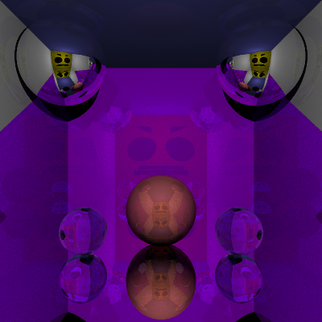
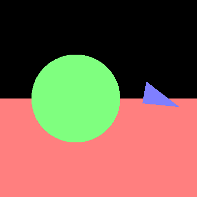

# COMP30019 - Project 1 - Ray Tracer

This is your README.md... you should write anything relevant to your
implementation here.

Please ensure your student details are specified below (*exactly* as on UniMelb
records):

**Name:** Sebastian Rey-Fleming \
**Student Number:** 1079887 \
**Username:** sreyfleming \
**Email:** sreyfleming@student.unimelb.edu.au

## Completed stages

Tick the stages bellow that you have completed so we know what to mark (by
editing README.md). **At most 9** marks can be chosen in total for stage
three. If you complete more than this many marks, pick your best one(s) to be
marked!

<!---
Tip: To tick, place an x between the square brackes [ ], like so: [x]
-->

##### Stage 1

- [x] Stage 1.1 - Familiarise yourself with the template
- [x] Stage 1.2 - Implement vector mathematics
- [x] Stage 1.3 - Fire a ray for each pixel
- [x] Stage 1.4 - Calculate ray-entity intersections
- [x] Stage 1.5 - Output primitives as solid colours

##### Stage 2

- [x] Stage 2.1 - Diffuse materials
- [x] Stage 2.2 - Shadow rays
- [x] Stage 2.3 - Reflective materials
- [x] Stage 2.4 - Refractive materials
- [x] Stage 2.5 - The Fresnel effect
- [x] Stage 2.6 - Anti-aliasing

##### Stage 3

- [ ] Option A - Emissive materials (+6)
- [x] Option B - Ambient lighting/occlusion (+6)
- [ ] Option C - OBJ models (+6)
- [x] Option D - Glossy materials (+3)
- [ ] Option E - Custom camera orientation (+3)
- [ ] Option F - Beer's law (+3)
- [ ] Option G - Depth of field (+3)

*Please summarise your approach(es) to stage 3 here.*

Ambient lighting/occlusion

To achieve this effect, I added an extra option to my diffuse surfaces, where if ambient lighting was enabled,
the program would run a loop, generating random vectors that are in the dot-product-positive hemisphere of the normal. These would then shoot off and eventually return a colour. This would then be added together with the direct lighting to produce the ambient lighting effect.

Glossy materials

For this I wasn't quite sure what 'glossy" was really asking for, so I ended up using a similar approach to ambient lighting. I would generate random vectors in the dot-product-postive hemisphere of the outgoing ray, and then add on the outgoing ray direction vector on top of this to narrow the rays down. I then tried to tune the direct lighting with the reflective lighting as much as I could. This is the material that is used for the purple walls in my final scene.

## Final scene render

Be sure to replace ```/images/final_scene.png``` with your final render so it
shows up here.



This render took 62 minutes and 34 seconds on my PC.

I used the following command to render the image exactly as shown:

```
dotnet run -- -f tests/sample_scene_3.txt -o images/final_scene.png -x 2 -l -q 1
```

## Sample outputs

We have provided you with some sample tests located at ```/tests/*```. So you
have some point of comparison, here are the outputs our ray tracer solution
produces for given command line inputs (for the first two stages, left and right
respectively):

###### Sample 1

```
dotnet run -- -f tests/sample_scene_1.txt -o images/sample_scene_1.png -x 4
```

<p float="left">
  
   
</p>

###### Sample 2

```
dotnet run -- -f tests/sample_scene_2.txt -o images/sample_scene_2.png -x 4
```

<p float="left">
  
   
</p>

## References

https://www.scratchapixel.com/lessons/3d-basic-rendering/minimal-ray-tracer-rendering-simple-shapes/ray-sphere-intersection

https://www.scratchapixel.com/lessons/3d-basic-rendering/phong-shader-BRDF/phong-illumination-models-brdf

https://www.scratchapixel.com/lessons/3d-basic-rendering/global-illumination-path-tracing

https://www.scratchapixel.com/code.php?id=34&origin=/lessons/3d-basic-rendering/global-illumination-path-tracing&src=0

https://www.scratchapixel.com/lessons/3d-basic-rendering/ray-tracing-overview

https://www.scratchapixel.com/lessons/3d-basic-rendering/introduction-to-shading/reflection-refraction-fresnel

https://www.scratchapixel.com/lessons/3d-basic-rendering/ray-tracing-generating-camera-rays/generating-camera-rays

https://www.scratchapixel.com/lessons/3d-basic-rendering/ray-tracing-rendering-a-triangle/ray-triangle-intersection-geometric-solution


*You must list any references you used - add them here!*

